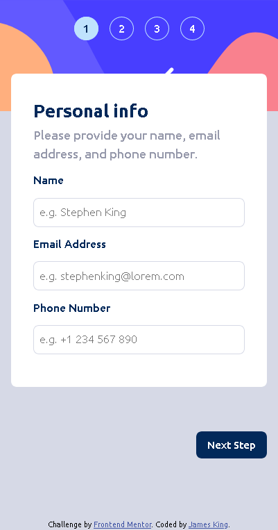

# Frontend Mentor - Multi-step form solution

This is a solution to the [Multi-step form challenge on Frontend Mentor](https://www.frontendmentor.io/challenges/multistep-form-YVAnSdqQBJ). Frontend Mentor challenges help you improve your coding skills by building realistic projects. 

## Table of contents

- [Overview](#overview)
  - [The challenge](#the-challenge)
  - [Screenshot](#screenshot)
  - [Links](#links)
- [My process](#my-process)
  - [Built with](#built-with)
  - [What I learned](#what-i-learned)
  - [Continued development](#continued-development)
- [Author](#author)

## Overview

### The challenge

Users should be able to:

- Complete each step of the sequence
- Go back to a previous step to update their selections
- See a summary of their selections on the final step and confirm their order
- View the optimal layout for the interface depending on their device's screen size
- See hover and focus states for all interactive elements on the page
- Receive form validation messages if:
  - A field has been missed
  - The email address is not formatted correctly
  - A step is submitted, but no selection has been made

### Screenshot




### Links

- Solution URL: [Solution](https://github.com/jamesaking02/multi-step-form)
- Live Site URL: [Live Site](https://your-live-site-url.com)

## My process

### Built with

- Semantic HTML5 markup
- CSS custom properties
- Flexbox
- CSS Grid
- SASS/SCSS
- Vanilla JS

### What I learned

I learned that you can repeat the parentElement property to get to a parent element higher up in the hierarchy! 

```js
addOn.addEventListener('change', (e) => {
  e.target.checked ? e.target.parentElement.parentElement.classList.add("checked") 
  : e.target.parentElement.parentElement.classList.remove("checked")
})
```

I'm also really proud of this piece of code, I find it as a pretty clever way to check for the switch to be turned to the yearly side. When it is I used it to dynamically change the content of the plan options and add-ons. Working with just vanilla JS to update content like that is very tedious.

```js
let yearPlanSelected = document.querySelector(".switch__circle").classList.contain("yearlyplan")
```

### Continued development

I still need to get better at my use of forEach. I ended up using a nested forEach loop at some point, and didn't realize that it was causing an issue without the help of Pieces Desktop.

## Author

- Frontend Mentor - [@jamesaking02](https://www.frontendmentor.io/profile/jamesaking02)
